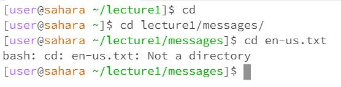
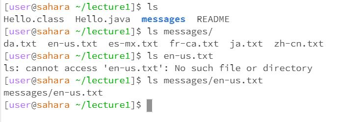
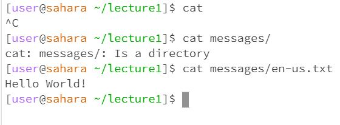

* When trying the cd command with no argument, the working directory is the lecture1 directory. The output of the command basically puts you in your home directory since there is no argument indicating any directory that you want to change to. The output is not an error.
* When trying the cd command with a path to a directory as an argument, the home directory is the working directory. The output of the command basically puts you in the directory path you had as an argument. In this case the output of the command, changed your directory to the messages directory since that was the argument. The output is not an error.
* When trying the cd command with a path to a file as an argument, the messages directory is the working directory. The output of the command is an error.The error was outputted because you were trying to change directory to a file. Essentially the cd command can only be used to change to a directory and not a file.

* When trying the ls command with no arguments, the working directory is the lecture1 directory. The output of the command basically shows all files and folders in the current working directory. The output is not an error.
* When trying the ls command with a path to a directory as an argument, the lecture1 directory is the working directory. The output of the command basically shows all files and folders in the directory as the argument. In this case since the messages/ directory is an argument, all files and folders in the messages directory is shown. This output is not an error.
* When trying the ls command with a path to a file as an argument, the lecture1 directory is the working directory. The output of the command shows the current file path. Since the argument is the path to a file and not a directory, the ls command will show the file path starting from the working directory. This output is not an error.

* When trying the cat command with no arguments, the working directory is the lecture1 directory. The output of the command is an error. The cat command stands for concatanate which basically reads the data of a file and outputs the content of said file. The problem with the cat command with no argument is that the terminal doesn't the file to read and output. In order for the cat command to work there must be a argument that tells the terminal which file to read and output. This output is an error that can be solved if the cat command is followed by a file argument.
* When trying the cat command with a directory as an argument, the lecture1 directory is the working directory. The output of the command tells you that the argument is a directory. This is because the cat command is supposed to read the argument which should be a file and output the contents of that file. The terminal is not able to read the contents of a directory since a directory only holds other files and directories, the content is not readable like a file is. Therefore, the message outputted explaining that messages is a directory just lets the user know that the argument passed in cannot be concatenated. This output is an error but luckily it tells you that passing a directory as an argument to be concatenated is an issue.
* When trying the cat command with a file as an argument, the lecture1 directory is the working directory. The output of the command prints out the contents of whatever file was passed in as argument. In this case, the argument for the cat command is en-us.txt in the messages directory which holds the contents "Hello World!". The output is not an error.
